<p align="center">
  
</p>

<h1 align="center">Peter View</h1>

<p align="center">
  Система автоматической вычитки русской документации.<br>
  Устанавливается в вашей инфраструктуре.
</p>

<p align="center">
  <a href="LICENSE"></a>
  <a href="https://badwisher.github.io/Peter-View/wiki/"></a>
  <a href="https://badwisher.github.io/Peter-View/"></a>
  <a href="https://github.com/BadWisher/Peter-View/pkgs/container/peter-view%2Fbackend"></a>
</p>

Peter View проверяет тексты по грамматике, корпоративному стилю и единообразию терминов. Результат проверки: список замечаний, каждое привязано к фрагменту документа. Языковая модель не обязательна: грамматика и Style Guide работают без неё. Исходные тексты во внешние сервисы не передаются, пока администратор сам не укажет адрес модели.

[Сайт](https://badwisher.github.io/Peter-View/) · [Документация](https://badwisher.github.io/Peter-View/wiki/) · [Установка и первый запуск](https://badwisher.github.io/Peter-View/wiki/tutorial/) · [Apache-2.0](LICENSE)

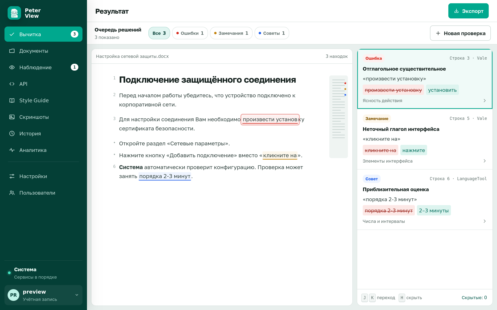

## Возможности

- Проверка **файла** (DOCX, TXT, HTML, MD до 50 МБ), **страницы по URL** или **вставленного текста**.
- Три независимых параметра: язык и ясность, Style Guide, термины и согласованность.
- Экран «Очередь решений»: карточки «Ошибка», «Замечание», «Совет», клавиши `J` / `K` / `H`, выгрузка xlsx.
- Корпоративный гайд: встроенный набор и импорт собственного документа (docx, txt, md).
- Роли редактор и администратор, локальный пароль или вход через организацию (OIDC).
- Необязательная языковая модель с протоколом OpenAI и проверка подключения из интерфейса.
- История проверок, аналитика частых правил, состояние сервисов.
- По флагу: репозиторий документов, связки OpenAPI RU/EN, наблюдение за страницами, редактор скриншотов.

## Требования

- Docker Engine и плагин Compose.
- Около 1.5 ГБ RAM на проверку языка (LanguageTool, Java) и до 2 ГБ на сервер приложений.
- Порт `3080` на хосте по умолчанию (`PROOFREADER_PORT`).

## Установка

```bash
git clone https://github.com/BadWisher/Peter-View.git
cd Peter-View
./deploy.sh
```

При отсутствии `.env` скрипт копирует `.env.example` и запускает три контейнера: интерфейс, сервер приложений, проверка языка. Первый запуск занимает около полутора минут. Когда в терминале появится «Готово», откройте http://localhost:3080.

Образы: `ghcr.io/badwisher/peter-view/backend` и `ghcr.io/badwisher/peter-view/frontend`. Данные хранятся в томе `backend-data`.

## Устройство

Три контейнера в одной внутренней сети. С хоста открыт только nginx (`PROOFREADER_PORT`, по умолчанию 3080).

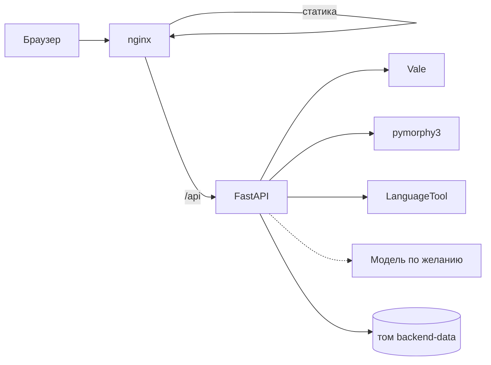

Интерфейс «Вычитка» ставит задачу `POST /api/jobs`. Сначала работают Vale, морфология и LanguageTool. Языковая модель подключается отдельным слоем, если администратор задал адрес. Отчёт пишется в историю на том же томе.

Подробности: [архитектура](https://badwisher.github.io/Peter-View/wiki/explanation/architecture/), [как проходит проверка](https://badwisher.github.io/Peter-View/wiki/explanation/pipeline/), [хранилище](https://badwisher.github.io/Peter-View/wiki/reference/data/), [HTTP API](https://badwisher.github.io/Peter-View/wiki/reference/http/).

## Первый запуск

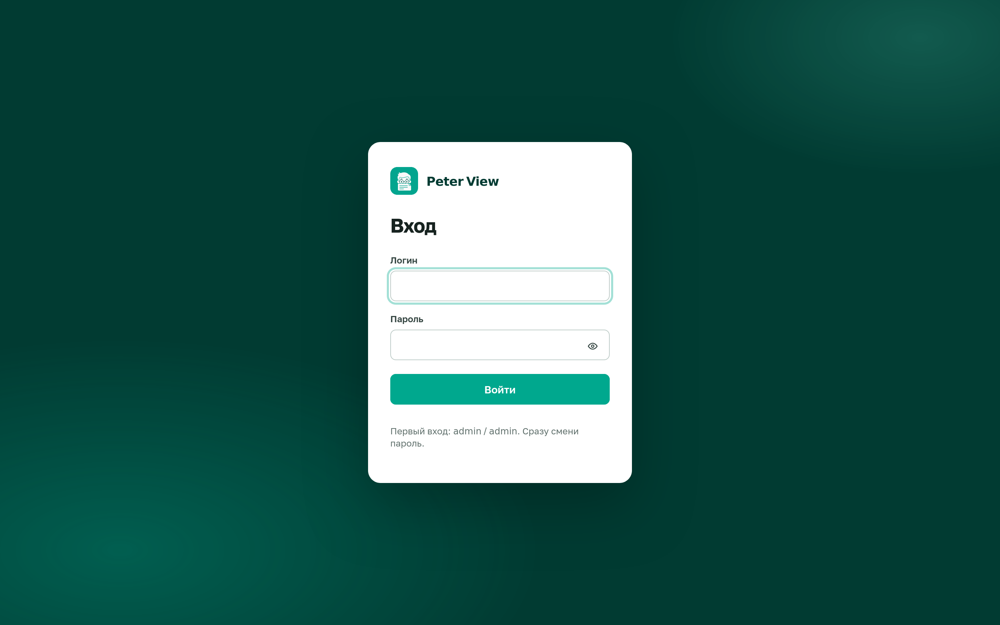

1. Войдите: логин `admin`, пароль `admin`.
2. Смените пароль. Меню учётной записи (инициалы слева внизу) → «Сменить пароль». Минимальная длина: 8 символов. Пока действует пароль `admin`, любой доступ к порту даёт права администратора.
3. Откройте раздел «Вычитка».

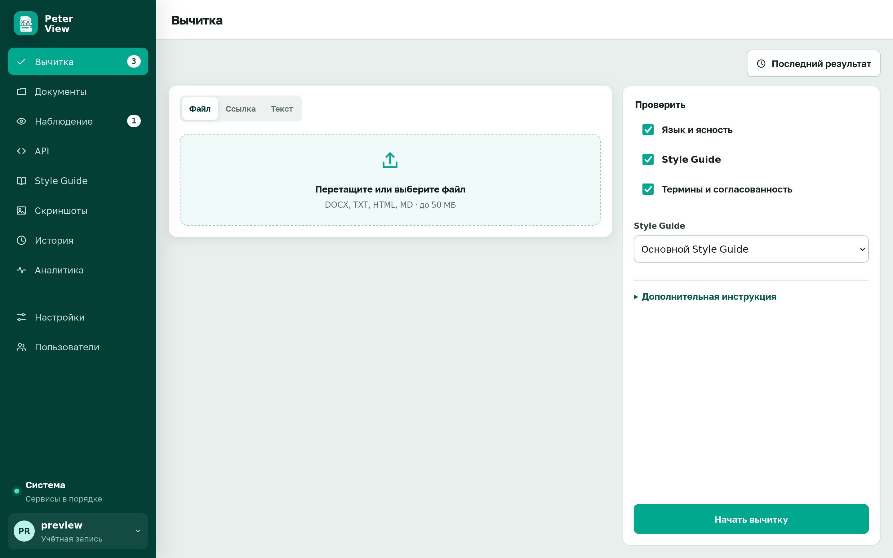

4. Вкладка «Текст». Вставьте контрольный фрагмент из [установки и первого запуска](https://badwisher.github.io/Peter-View/wiki/tutorial/) и нажмите «Начать вычитку».
5. Дождитесь экрана «Очередь решений». `J` и `K` переключают карточки, `H` скрывает текущую. «Экспорт» сохраняет видимые замечания в xlsx.

Полная последовательность с тем же фрагментом: [установка и первый запуск](https://badwisher.github.io/Peter-View/wiki/tutorial/).

## Разделы интерфейса

Эти разделы доступны сразу после установки.

| Раздел | Назначение |
|---|---|
| Вычитка | Источник документа и состав проверки |
| Очередь решений | Список замечаний после проверки |
| Style Guide | Правила и словарь, кнопка «Использовать» |
| История | Завершённые проверки |
| Аналитика | Какие правила срабатывают чаще |
| Пользователи | Учётные записи (только администратор) |
| Настройки | Адрес модели и эмбеддингов (только администратор) |
| Система | Состояние сервисов (только администратор) |

<table>
  <tr>
    <td>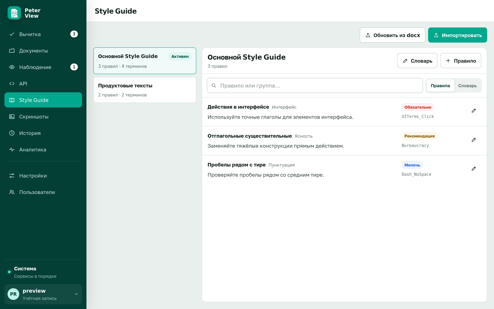</td>
    <td>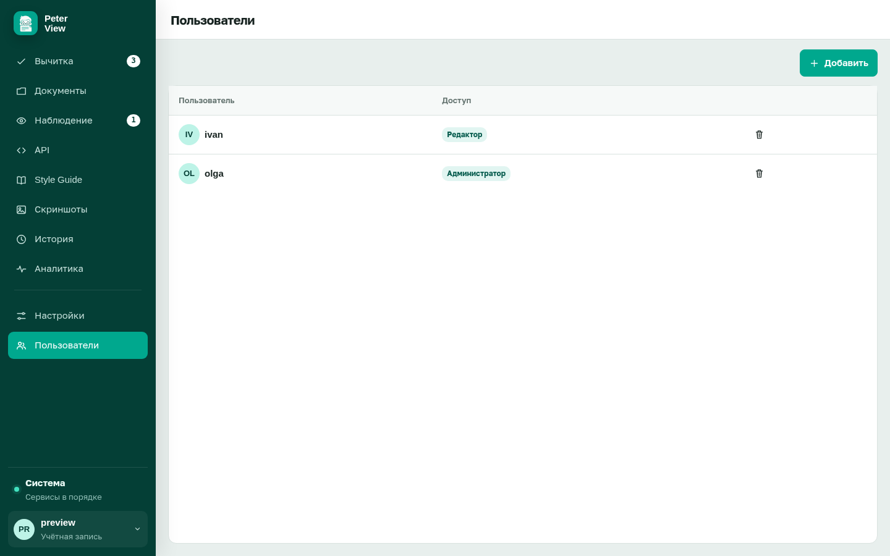</td>
  </tr>
  <tr>
    <td>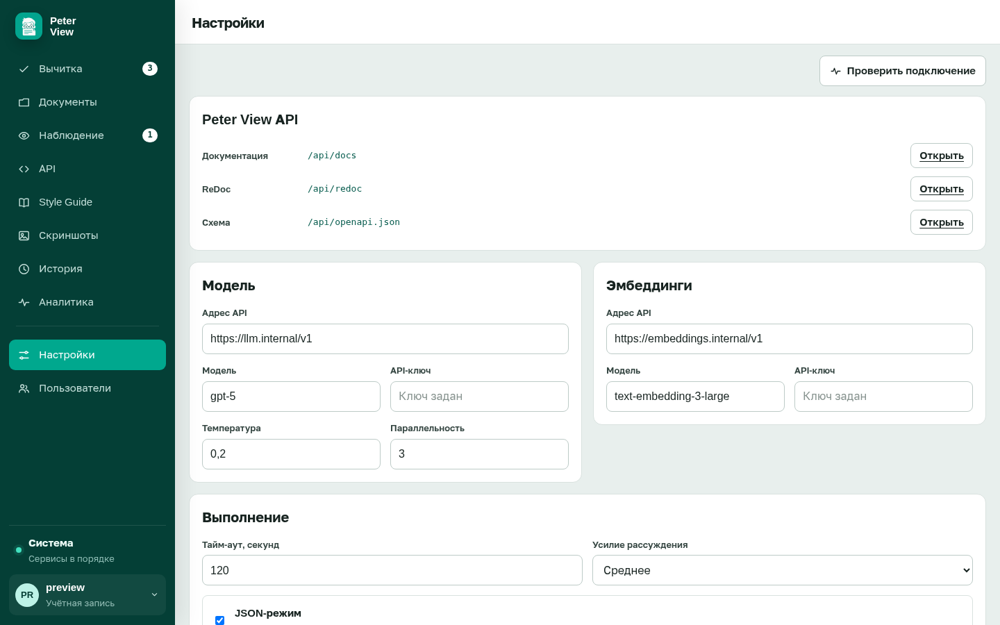</td>
    <td>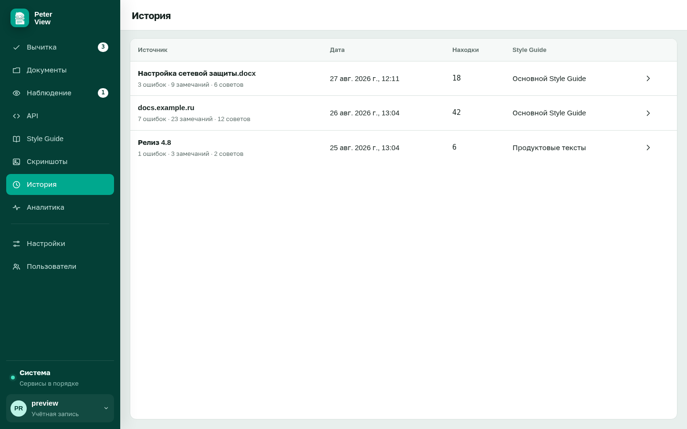</td>
  </tr>
  <tr>
    <td>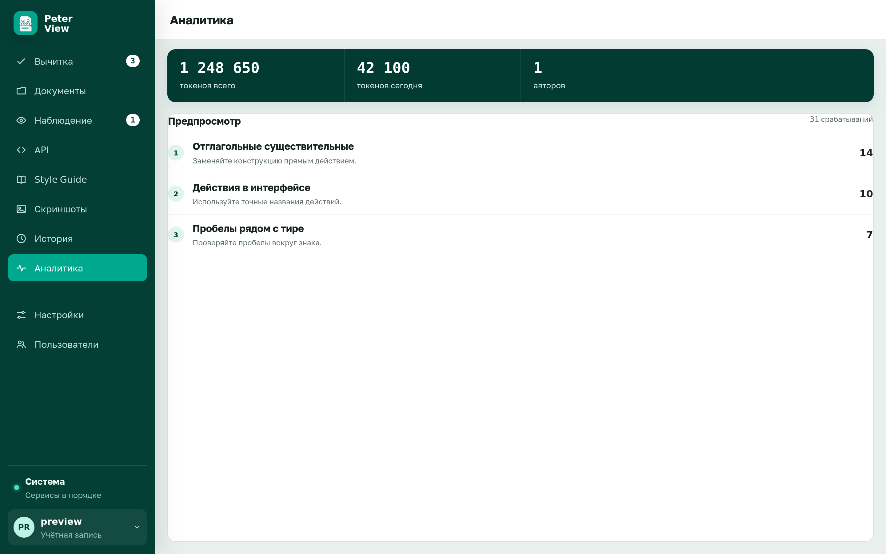</td>
    <td>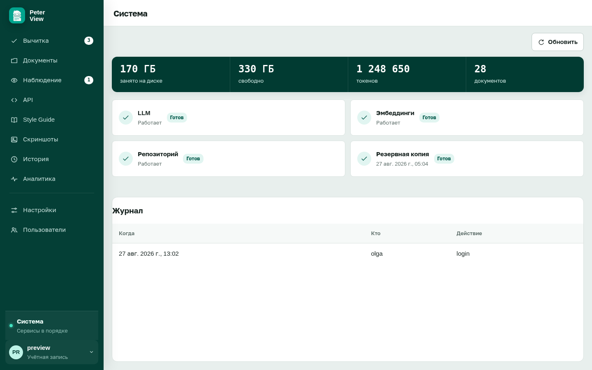</td>
  </tr>
</table>

Узкий экран:

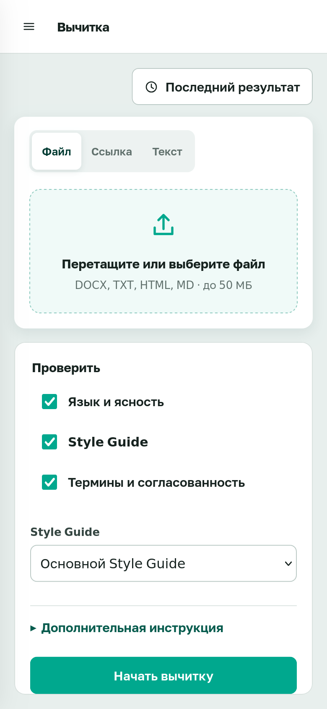

Инструкции: [проверка источника](https://badwisher.github.io/Peter-View/wiki/how-to/check/), [список замечаний](https://badwisher.github.io/Peter-View/wiki/how-to/review/), [Style Guide](https://badwisher.github.io/Peter-View/wiki/how-to/styleguide/), [пользователи](https://badwisher.github.io/Peter-View/wiki/how-to/users/), [языковая модель](https://badwisher.github.io/Peter-View/wiki/how-to/llm/).

## Дополнительные разделы

По умолчанию выключены. Включаются в `.env` без пересборки интерфейса:

```env
FEATURE_DOCUMENTS=true
FEATURE_API=true
FEATURE_WATCH=true
FEATURE_SCREENSHOTS=true
```

Затем `./deploy.sh`.

| Флаг | Раздел | Назначение |
|---|---|---|
| `FEATURE_DOCUMENTS` | Документы | Папки, версии файлов, архив |
| `FEATURE_API` | API | Связка OpenAPI RU/EN |
| `FEATURE_WATCH` | Наблюдение | Снимки страниц по расписанию |
| `FEATURE_SCREENSHOTS` | Скриншоты | Кадрирование и скрытие областей |

<table>
  <tr>
    <td>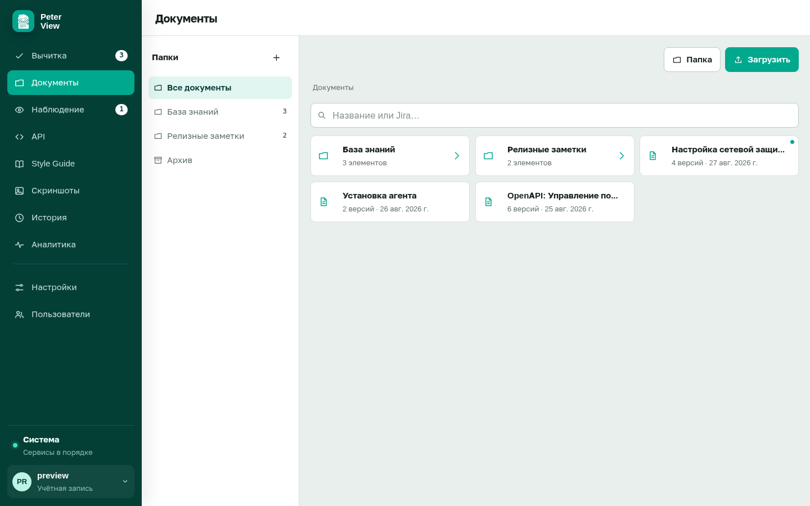</td>
    <td>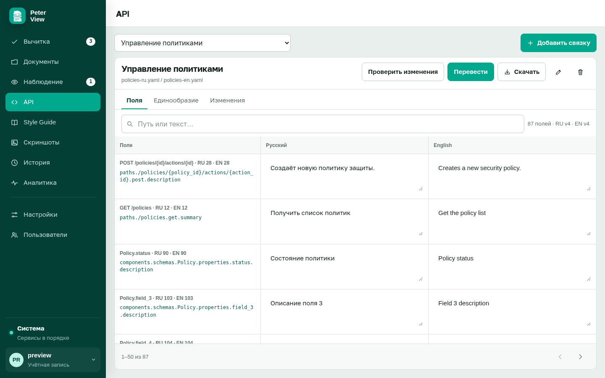</td>
  </tr>
  <tr>
    <td></td>
    <td>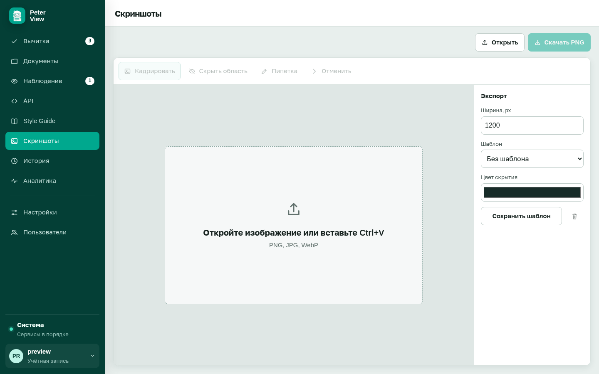</td>
  </tr>
</table>

Как включить: [дополнительные разделы](https://badwisher.github.io/Peter-View/wiki/how-to/features/). Назначение: [документы](https://badwisher.github.io/Peter-View/wiki/how-to/documents/), [OpenAPI](https://badwisher.github.io/Peter-View/wiki/how-to/api/), [наблюдение](https://badwisher.github.io/Peter-View/wiki/how-to/watch/), [скриншоты](https://badwisher.github.io/Peter-View/wiki/how-to/screenshots/).

## Документация

| Задача | Раздел |
|---|---|
| Установка и контрольная проверка | [Установка и первый запуск](https://badwisher.github.io/Peter-View/wiki/tutorial/) |
| Файл, ссылка или другой текст | [Проверка источника](https://badwisher.github.io/Peter-View/wiki/how-to/check/) |
| Просмотр замечаний и таблица xlsx | [Список замечаний](https://badwisher.github.io/Peter-View/wiki/how-to/review/) |
| Пользователи и роли | [Пользователи](https://badwisher.github.io/Peter-View/wiki/how-to/users/) |
| Вход организации (Keycloak, Azure AD) | [OIDC](https://badwisher.github.io/Peter-View/wiki/how-to/oidc/) |
| Имена переменных | [Справка .env](https://badwisher.github.io/Peter-View/wiki/reference/config/) |
| Состав стека и путь запроса | [Архитектура](https://badwisher.github.io/Peter-View/wiki/explanation/architecture/) |
| Как из кнопки получается список | [Проверка](https://badwisher.github.io/Peter-View/wiki/explanation/pipeline/) |
| Файлы на томе | [Хранилище](https://badwisher.github.io/Peter-View/wiki/reference/data/) |
| HTTP API | [Справка API](https://badwisher.github.io/Peter-View/wiki/reference/http/) |
| Зачем система устроена так | [Назначение](https://badwisher.github.io/Peter-View/wiki/explanation/what/) |

Полный указатель: [документация](https://badwisher.github.io/Peter-View/wiki/).

## Лицензия

Apache-2.0. На адрес автора проекта проверка ничего не отправляет.
