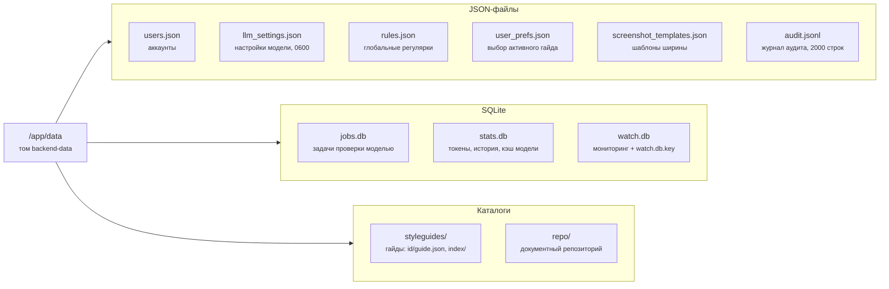

# Хранилище данных

Эта страница описывает все персистентные данные сервиса: их расположение,
формат хранения и правила жизненного цикла. Она нужна тем, кто читает код
работы с данными, переносит том с места на место или восстанавливает сервис из
резервной копии. Здесь приведены каталог данных, назначение каждой базы SQLite
и каждого JSON-файла, правила очистки и схема согласованности.

Страница отвечает на вопросы: где лежат учетные записи и отчеты, сколько
хранятся история и снимки, что произойдет с данными при перезапуске процесса.
Резервное копирование и восстановление описаны в [**Implementation Guide**](../ops/deploy.md) на
странице [**Резервное копирование и восстановление**](../ops/backup.md).

## Общий принцип

Все персистентные данные лежат в каталоге `/app/data`, который примонтирован из
тома `backend-data`. Хранилище составляют три базы SQLite, несколько JSON-файлов
и два каталога. Форматы выбраны по принципу «без внешних зависимостей».
Приложение читает и пишет данные само, миграций схемы нет, а совместимость
старых файлов обеспечивает код приложения.

## Каталог данных

## JSON-файлы

Назначение и форма каждого JSON-файла приведены в таблице ниже.

| Файл | Форма | Примечание |
|---|---|---|
| `users.json` | `{username: {password_hash, role, source}}` | хэши bcrypt; при пустом файле сервис создает учетную запись `admin/admin` |
| `llm_settings.json` | плоский словарь полей из схемы `SPEC` | пишется с umask 0077 и chmod 600; при отсутствии читается из значений окружения |
| `rules.json` | `[{id, pattern, message, severity}]` | идентификатор uuid, паттерн валидируется при записи |
| `user_prefs.json` | `{username: {styleguide_id}}` | хранит только выбор активного гайда |
| `screenshot_templates.json` | `[{id, name, width}]` | шаблоны глобальные, не по пользователям |
| `audit.jsonl` | строки JSON: ts, actor, action, detail | только добавление, файл обрезается до 2000 строк |

## База jobs.db

База содержит одну таблицу `jobs(id, source, status, stage, report, error,
created_at)`. Поле `report` хранит весь отчет проверки в формате JSON в колонке
TEXT. Такой выбор дает готовым отчетам переживать перезапуск процесса, а
незавершенные задачи при старте помечаются значением `status=error` с текстом
«Прервано рестартом сервера».

Буферы стрима воркеров в базу не пишутся: они живут только в памяти, до
`LLM_STREAM_BLOCK_CAP` знаков на блок. Живые задачи хранятся в памяти час
(`JOB_TTL_SECONDS`). Записи в самой базе не удаляются автоматически: таблица
растет до ручного `VACUUM`. При заполнении диска именно эта таблица первый
кандидат на очистку.

## База stats.db

Состав таблиц базы приведен в таблице ниже.

| Таблица | Содержимое |
|---|---|
| `token_usage` | ts, user, job_id, prompt, completion, cached tokens, worker |
| `rule_hits` | первичный ключ (user, rule_id), description, count, last_ts; база раздела **Аналитика** |
| `check_history` | id, user, ts, source, гайд, счетчики и полный `report`; 50 строк на пользователя, старые удаляются |
| `doc_views` | первичный ключ (user, doc_id) и ts; отметки «видел» в репозитории |
| `llm_cache` | key это хеш промпта, response это JSON, плюс ts; персистентный кэш ответов модели |

## База watch.db

База содержит таблицы `groups` (параметры авторизации групп, пароли скрыты
потоком XOR), `pages`, `snapshots` (текст в пределах `WATCH_TEXT_CAP`, JSON DOM
в пределах `WATCH_DOM_CAP`, находки, флаг current) и `meta`. На страницу
держится 14 снимков, более старые срезаются. Ключ маскирования лежит в файле
`watch.db.key` рядом с базой.

## Каталог styleguides

Каждый гайд занимает директорию `<id>/guide.json` с полями meta, rules и
lexicon (запрещенные и предпочтительные термины). Встроенный гайд `default`
загружается из `backend/styleguide/rules.yaml`, который смонтирован в контейнер
только для чтения; удалить его нельзя. Соседний каталог `<id>/index/` служебный.
Это кэш подбора правил, его не трогают руками, потому что индексы живут в
памяти и перестраиваются по хешу содержимого.

## Каталог repo

Каталог повторяет файловую иерархию репозитория документов. Папки это
директории с файлом `folder.json`, документы занимают подкаталоги `<doc-id>/` с
файлом `doc.json` (метаданные, версии, отметки просмотра) и самими файлами
версий: `1.docx`, `2.docx` и так далее. Архивная папка отдельная, и документы
переезжают в нее физически. Идентификаторы папок и документов проходят
валидацию регулярным выражением против path traversal.

## Согласованность и восстановление

Файлы и базы пишет один процесс: на JSON-файлах стоят блокировки `Lock`, а базы
SQLite работают в режиме отката журнала по умолчанию. Снимок всего каталога
`data/` командой tar достаточен для восстановления, потому что журнал SQLite
откатывается сам при следующем открытии после сбоя. Порядок резервного
копирования и проверки восстановления описан в [**Implementation Guide**](../ops/deploy.md) на
странице [**Резервное копирование и восстановление**](../ops/backup.md).

## Связанные разделы

Страницы, продолжающие тему данных.

- [Стек контейнеров](../ops/stack.md) куда именно монтируется том
  `backend-data`.
- [Конвейер проверки моделью](pipeline.md) откуда берется поле `report` в
  таблицах `jobs.db` и `stats.db`.
- [Детерминированные движки проверки](engines.md) как устроены правила из
  `rules.json` и каталога `styleguides/`.
- [Прикладные подсистемы](subsystems.md) структура каталога `repo/` и базы
  `watch.db`.
