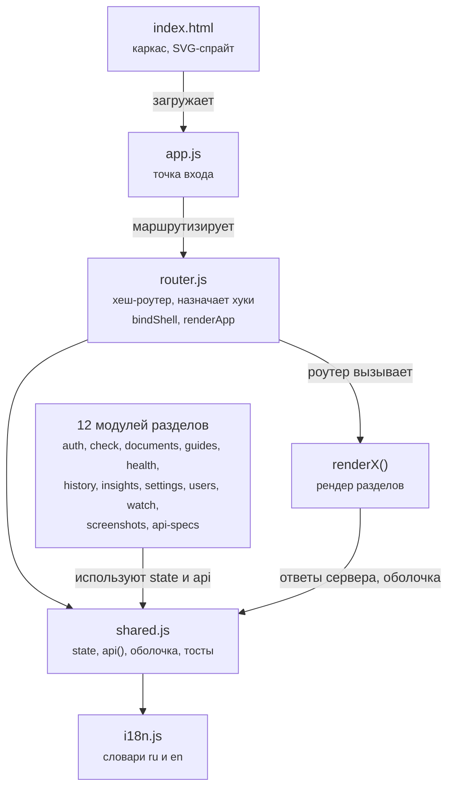

# Карта фронтенда

Эта страница структурный справочник одностраничного приложения: маршруты,
модули, зависимости между ними, соответствие экранов и эндпоинтов и точки
расширения. Она нужна разработчику, который открывает фронтенд впервые и хочет
понять, где что лежит, прежде чем править.

Страница отвечает на вопросы: как устроен каркас страницы, какие модули за что
отвечают, как добавить новый экран и где разбираются ответы сервера. Конвенции
записи кода описаны в [**Developer Guide**](../dev/setup.md) на странице [**Фронтенд на
vanilla JS**](../dev/frontend.md), контракты сервера на странице [**HTTP API**](../dev/api.md).

## Каркас страницы

Файл `index.html` это статический скелет на 58 строк. Порядок загрузки ресурсов
зафиксирован и приведен ниже.

1. `theme-boot.js` обычный classic script, который до отрисовки ставит атрибут
   `data-theme` из localStorage.
2. `tokens.css` и `style.css`, версии которых задаются параметрами `?v=48` и
   `?v=52` вручную.
3. `js/app.js` как модуль `type="module"`; остальные модули доезжают по графу
   импортов.

Внутри HTML размечены три контейнера (`#app`, `#overlay-root`, `#toast-root`) и
SVG-спрайт на 32 иконки. Шаблонов в HTML нет, вся разметка собирается из JS.

## Модули и граф зависимостей

Ответственность каждого модуля и его объем в строках показывает таблица ниже.

| Модуль | Строк | Ответственность |
|---|---|---|
| `shared.js` | 956 | `state`, функция `api()`, оболочка (сайдбар и топбар), модальные окна, тосты, тема, бейдж здоровья; около 480 строк занимает мок `previewApi` для демо-режима |
| `watch.js` | 865 | раздел **Наблюдение**: список групп, композер, страница, сравнение, копия в iframe, слияние хунков и UI-событий в фразы |
| `check.js` | 815 | форма проверки, стрим воркеров по SSE, экран разбора, подсветка, экспорт |
| `guides.js` | 452 | гайды: список, вкладки правил и лексикона, CRUD, извлечение из DOCX, механизм слияния гайда |
| `api-specs.js` | 286 | раздел [**Спецификации API**](../users/openapi.md): пары RU и EN, сегменты с правками, единообразие, изменения, перевод и обзор моделью |
| `documents.js` | 217 | библиотека папок и версий, загрузка перетаскиванием, архив |
| `screenshots.js` | 216 | canvas-редактор: crop, redact, picker, отмена на 6 шагов, экспорт с шириной из шаблона |
| `auth.js` | 115 | вход, выход, смена пароля, `loadInitialData` |
| `app.js` | 77 | загрузка приложения, горячие клавиши `j`, `k`, `h`, обработчик `hashchange` |
| остальные | 42-60 | `settings` 60, `shell` 51, `users` 46, `router` 44, `insights` 42, `i18n` 37, `health` 35, `history` 27: админ-формы, связка событий оболочки, таблицы |

Замкнутые циклы импортов (модуль `shared` связан с `check`, `watch` и `auth`)
разорваны объектом `hooks`: `shared.js` вызывает `hooks.bindShell` и
`hooks.renderApp`, а назначает их `app.js` при старте.

## Таблица маршрутов

Приложение использует хеш-маршруты. Разбирает адрес функция `currentRoute()`,
диспетчеризация живет в `router.js`. Состав маршрутов и их guard'ы показывает
таблица ниже.

| Хеш | Функция отрисовки | Условие доступа |
|---|---|---|
| `#/check` | `check.renderCheck` | вход |
| `#/review` | `check.renderReview` | вход (в навигации скрыт, активен как пункт **Вычитка**) |
| `#/guides` | `guides.renderGuides` | вход |
| `#/history`, `#/insights` | модули `history`, `insights` | вход |
| `#/documents` | `documents.renderDocuments` | вход и флаг `FEATURE_DOCUMENTS` |
| `#/watch[/gid[/pid]]` | `watch.renderWatch` | вход и флаг `FEATURE_WATCH` |
| `#/api` | `api-specs.renderApiSpecs` | вход и флаг `FEATURE_API` |
| `#/screenshots` | `screenshots.renderScreenshots` | вход и флаг `FEATURE_SCREENSHOTS` |
| `#/settings`, `#/users`, `#/health` | соответствующие модули | вход и роль администратора |

Непройденный guard дает `history.replaceState` на маршрут `#/check`. Аргументы
раздела **Наблюдение** читаются из сегментов хеша. Неизвестный маршрут
трактуется как `check`.

## Соответствие экранов и эндпоинтов

Таблица ниже показывает, какие эндпоинты читает каждый экран и какие вызывает
для записи.

| Экран | Читает | Вызывает для записи |
|---|---|---|
| Вход | `GET /api/config` | `POST /api/auth/login`, `GET /api/auth/oidc/start` |
| Загрузка приложения | `GET /api/auth/me`, `/api/styleguides`, `/api/config` | нет |
| **Вычитка** | нет | `POST /api/jobs`, `GET /api/jobs/{id}` и его суффиксы `stream`, `report` |
| Разбор | поля `report.blocks` и `issues` | `POST /api/report-issues` (XLSX) |
| Гайды | `GET /api/styleguides`, суффиксы id и `index-status` | выбор, PUT, POST, DELETE, извлечение с опросом |
| История | `GET /api/checks/history` и путь с id | открывает сохраненный отчет в разборе |
| Аналитика | `GET /api/checks/insights` | нет |
| Пользователи | `GET /api/users` | POST, DELETE |
| Настройки | `GET /api/settings` | `PUT /api/settings`, `POST /api/settings/test` |
| Система | `GET /api/health/full` | только обновление (кэш бейджа 60 секунд) |
| Документы | `GET /api/repo/folders`, `search`, `archived`, `documents/{id}` | CRUD папок и документов, версии, архив |
| Спецификации API | `GET /api/api-specs` и суффиксы `segments`, `consistency`, `diff` | CRUD, перевод и обзор моделью через очередь задач, выгрузка |
| Наблюдение | `GET /api/watch/groups` и суффиксы `pages`, `diff`, `copy`, `history` | CRUD, запуск обхода, отметка просмотра |
| Скриншоты | `GET /api/screenshot-templates` | POST, DELETE (редактор целиком клиентский) |

## Точки расширения

Ниже перечислены места, куда разработчик вмешивается чаще всего, и правило для
каждого случая.

- Новый экран требует трех строк: модуль с функцией `renderX`, импорт в
  `router.js`, пункт в `navItems` и `routeMeta`. Если экран отключаемый,
  добавляется флаг в `FEATURE_ROUTES`. Пошаговая процедура описана на
  странице [**Фронтенд на vanilla JS**](../dev/frontend.md) в подразделе про добавление раздела.
- Новая форма замечания настраивается в одном месте: алиасы полей ответов
  сервера разбирает функция `normalizedIssues()` в `check.js` (строка около
  555). Правки вносятся там, а не на месте использования.
- Демо-режим требует внимания к каждой новой ручке: для нее нужен кейс в
  `previewApi` внутри `shared.js`, иначе страница `?preview=1` падает на этом
  экране.

## Известные отклонения

Небольшие расхождения в коде обнаруживаются при ручном ревью правок. Список
приведен ниже, чтобы читатель карты не считал их особенностями архитектуры.

- В `guides.js` обработчик ошибок использует переменные `overlayRoot` и `app`
  без импорта, что приводит к падению на пути ошибки.
- В `documents.js` ветка предпросмотра вызывает неимпортированный `previewApi`.
- В спрайте отсутствует иконка `icon-copy`, на которую ссылается панель копии
  раздела **Наблюдение**.
- Объявлены, но не используются иконки `icon-filter`, `icon-more` и
  `icon-star`.

## Связанные разделы

Страницы, продолжение темы фронтенда.

- [Фронтенд на vanilla JS](../dev/frontend.md) конвенции и стиль кода.
- [Карта кода](../dev/code-map.md) где лежит весь остальной репозиторий.
- [Механизмы защиты](security.md) почему CSP запрещает инлайн-скрипты, а
  копия страницы рендерится в изолированной рамке.
- [Проектные решения](decisions.md) почему SPA без фреймворка и с полной
  перерисовкой экрана.
