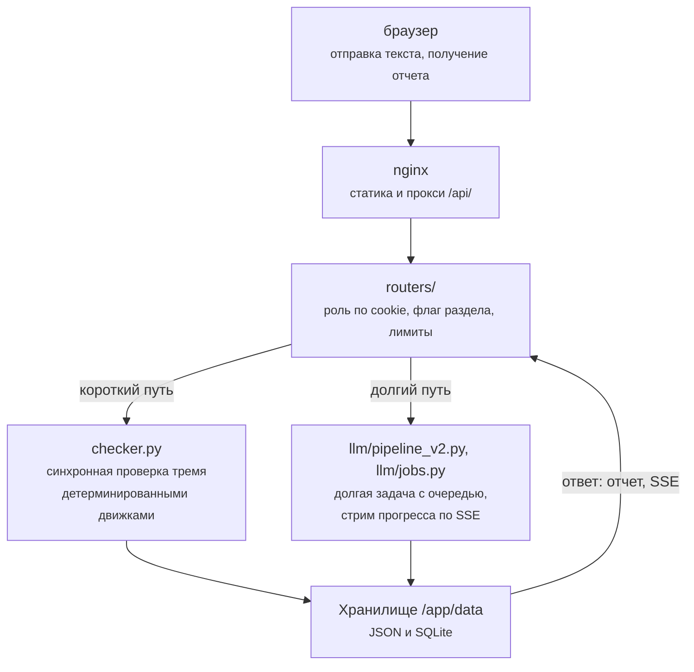

# Карта кода

Эта страница справочник расположения файлов репозитория: где что лежит и за
что отвечает. Она нужна разработчику как ориентир перед чтением исходников.
Объяснений устройства здесь нет, только ответственность каждого каталога и
модуля. За устройством системы обратитесь к разделу [**Архитектура**](../arch/overview.md), начиная
со страницы [**Общая архитектура**](../arch/overview.md).

Страница отвечает на вопросы: в каком файле искать нужный код и как устроен
путь запроса через слои приложения.

## Состав репозитория

Дерево каталогов и файлов с краткими подписями приведено ниже.
Подписи к файлам это предметные пояснения, а не проза, поэтому правила к
прозе на них не распространяются.

```text
Peter-View/
├── docker-compose.yml            три сервиса, тома, healthchecks
├── docker-compose.prod.yml       override: образы из GHCR вместо сборки
├── docker-compose.corp-proxy.yml override: трафик через корп-прокси
├── deploy.sh                     сборка, запуск, ожидание фронта
├── Makefile                      deploy, test, lint, regression, backup
├── .env.example                  все переменные с комментариями
├── pyproject.toml                конфиг pytest
├── mkdocs.yml                    сборщик вики: docs_dir=wiki
├── backend/
│   ├── Dockerfile                python:3.12-slim + vale + chromium
│   ├── requirements.txt          21 пакет; -dev: pytest, ruff
│   ├── app/
│   │   ├── main.py               FastAPI-приложение, запуск
│   │   ├── routers/              HTTP-слой: auth, checks, jobs,
│   │   │                         history, infra, openapi_meta
│   │   ├── checker.py            фасад детерминированных движков
│   │   ├── lt_client.py          клиент LanguageTool
│   │   ├── vale_runner.py        подпроцесс Vale
│   │   ├── custom_checks.py      морфология на pymorphy3 и razdel
│   │   ├── style_guide_registry.py  реестр правил
│   │   ├── llm/                  конвейер модельной вычитки:
│   │   │   ├── pipeline_v2.py    планировщик стадий
│   │   │   ├── workers.py        воркеры модели
│   │   │   ├── jobs.py           очередь задач
│   │   │   ├── client.py         HTTP-клиент модели
│   │   │   ├── documents.py      разбор входов в блоки
│   │   │   ├── evidence.py       верификация находок
│   │   │   └── repo_store.py, watch_*.py, shot_templates.py
│   │   └── auth.py, oidc.py, net_guard.py, backups.py, report.py
│   ├── styleguide/rules.yaml     правила для модели
│   ├── vale/                     стили Vale
│   └── tests/                    pytest-тесты и регрессия
├── frontend/
│   ├── Dockerfile, nginx.conf    статика + обратный прокси
│   └── public/
│       ├── index.html            каркас, SVG-спрайт
│       └── js/                   app.js, router.js, shared.js,
│                                 i18n.js, 12 модулей разделов
├── wiki/                         исходники этой документации
├── docs/                         собранная вики для Pages
├── examples/openapi/             примеры спецификаций
└── .github/workflows/            ci.yml, pages.yml, publish.yml
```

## Путь запроса в бэкенде

Бэкенд делится на три слоя, и путь большинства запросов проходит их в одном
порядке. Схема ниже показывает этот путь: от браузера через nginx и
`routers/` к одному из двух исполнителей и далее в хранилище.



Модули каталога `routers/` проверяют роль по cookie и флаг раздела, валидируют
вход по лимитам и вызывают следующий слой. Дальше запрос идет либо в
`checker.py` с его движками (синхронная детерминированная проверка), либо в
`llm/pipeline_v2.py` (долгая задача с очередью через `llm/jobs.py`).
Хранилище принимает записи: все данные пишутся в файлы и SQLite под
`/app/data`. Кто чем владеет описано на странице [**Хранилище данных**](../arch/data-model.md).

При чтении кода держите в уме: файлы `styleguide/rules.yaml` и
`style_guide_registry.py` дублируют содержимое намеренно. Первый питает модель,
второй обслуживает движки и интерфейс. Тест `test_styleguide_consistency.py`
не позволяет им разойтись.

## Путь запроса на фронте

Модуль `app.js` загружается из `index.html`, инициализирует i18n, запрашивает
`/api/auth/me`, после чего `router.js` по хешу адреса вызывает нужную функцию
`renderX()`. Каждый экран это отдельный ES-модуль, а общие части (оболочка,
тосты, модальные окна, функция `api()`) живут в `shared.js`. Полная карта
маршрутов и связей модулей находится на странице [**Карта фронтенда**](../arch/frontend-map.md).

## Связанные разделы

Страницы, куда ведут вопросы по коду.

- [Бэкенд на FastAPI](backend.md) конвенции, добавление движка и маршрута.
- [Фронтенд на vanilla JS](frontend.md) конвенции и добавление раздела.
- [Правила Style Guide в коде](guides-rules.md) форматы правил во всех трех
  представлениях.
- [Тесты и регрессия](tests.md) что и как прогонять.
- [HTTP API](api.md) справочник маршрутов.
- [Общая архитектура](../arch/overview.md) как части стыкуются.
