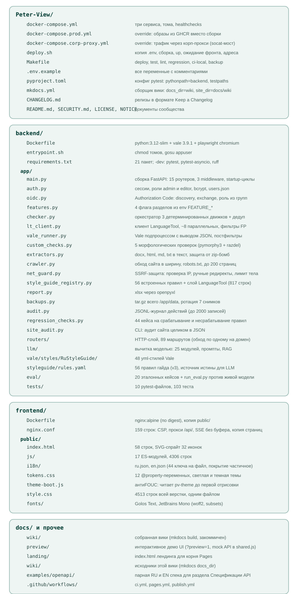
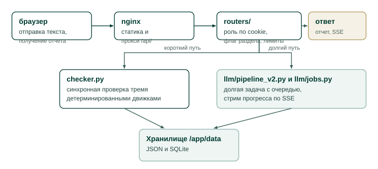

# Карта кода

Эта страница справочник расположения файлов репозитория: где что лежит и за
что отвечает. Она нужна разработчику как ориентир перед чтением исходников.
Объяснений устройства здесь нет, только ответственность каждого каталога и
модуля. За устройством системы обратитесь к разделу [**Архитектура**](../arch/overview.md), начиная
со страницы [**Общая архитектура**](../arch/overview.md).

Страница отвечает на вопросы: в каком файле искать нужный код и как устроен
путь запроса через слои приложения.

## Состав репозитория

Дерево каталогов и файлов с краткими подписями показано на схеме ниже.
Подписи к файлам это предметные пояснения, а не проза, поэтому правила к
прозе на них не распространяются.

<figure>
  
  <figcaption>Файлы репозитория по каталогам. Внутри backend показаны модули каталога app, отдельно перечислены подкаталоги vale, styleguide, eval и tests. Внутри frontend перечислено содержимое public.</figcaption>
</figure>

## Путь запроса в бэкенде

Бэкенд делится на три слоя, и путь большинства запросов проходит их в одном
порядке. Схема ниже показывает этот путь: от браузера через nginx и
`routers/` к одному из двух исполнителей и далее в хранилище.

<figure>
  
  <figcaption>Запрос проходит валидацию в routers/ и раздваивается: синхронная
  проверка движками или долгая задача моделью с очередью и стримом по SSE. Оба
  пути пишут результат в хранилище /app/data.</figcaption>
</figure>

Модули каталога `routers/` проверяют роль по cookie и флаг раздела, валидируют
вход по лимитам и вызывают следующий слой. Дальше запрос идет либо в
`checker.py` с его движками (синхронная детерминированная проверка), либо в
`llm/pipeline_v2.py` (долгая задача с очередью через `llm/jobs.py`).
Хранилище принимает записи: все данные пишутся в файлы и SQLite под
`/app/data`. Кто чем владеет описано на странице [**Хранилище данных**](../arch/data-model.md).

При чтении кода держите в уме: файлы `styleguide/rules.yaml` и
`style_guide_registry.py` дублируют содержимое намеренно. Первый питает модель,
второй обслуживает движки и интерфейс. Тест `test_styleguide_consistency.py`
не позволяет им разойтись.

## Путь запроса на фронте

Модуль `app.js` загружается из `index.html`, инициализирует i18n, запрашивает
`/api/auth/me`, после чего `router.js` по хешу адреса вызывает нужную функцию
`renderX()`. Каждый экран это отдельный ES-модуль, а общие части (оболочка,
тосты, модальные окна, функция `api()`) живут в `shared.js`. Полная карта
маршрутов и связей модулей находится на странице [**Карта фронтенда**](../arch/frontend-map.md).

## Связанные разделы

Страницы, куда ведут вопросы по коду.

- [Бэкенд на FastAPI](backend.md) конвенции, добавление движка и маршрута.
- [Фронтенд на vanilla JS](frontend.md) конвенции и добавление раздела.
- [Правила Style Guide в коде](guides-rules.md) форматы правил во всех трех
  представлениях.
- [Тесты и регрессия](tests.md) что и как прогонять.
- [HTTP API](api.md) справочник маршрутов.
- [Общая архитектура](../arch/overview.md) как части стыкуются.
