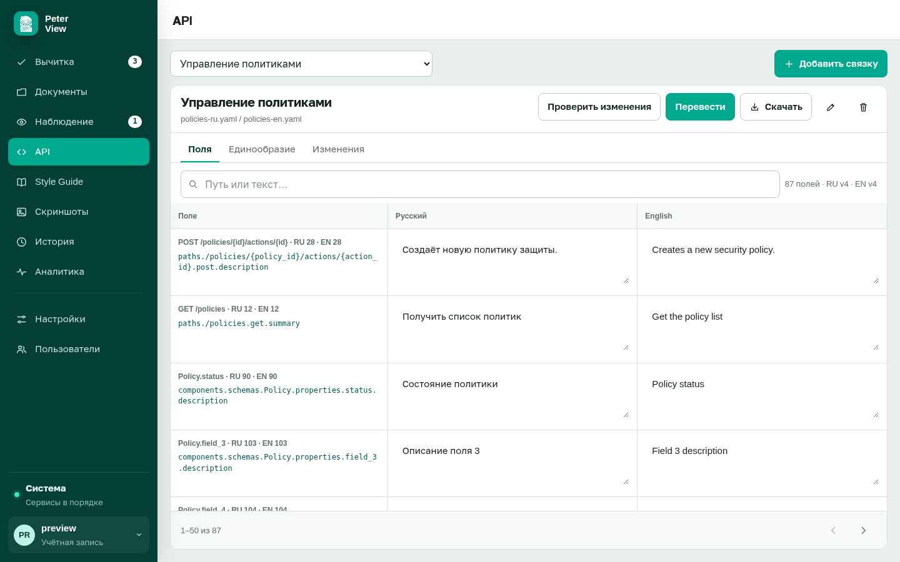

# Связка OpenAPI

Требуется `FEATURE_API=true`. Для выбора файлов нужен также `FEATURE_DOCUMENTS=true`. Раздел «API» сравнивает русскую и английскую спецификации одной службы.

Учебные файлы лежат в исходниках: `examples/openapi/library-ru.yaml` и `library-en.yaml`. Загрузите их в «Документы», затем создайте связку.

## Создание связки

«Добавить связку». Поля:

- название связки
- документ RU
- документ EN

Список документов берётся из репозитория. Если документов нет, сначала загрузите YAML в «Документы».

Переключатель связок в шапке, если связок несколько. Значок карандаша меняет название и документы. Корзина удаляет связку.

Пустой раздел: «Связок пока нет».

## Вкладка «Поля»

Таблица сегментов: путь в спецификации, русский текст, английский текст. Поиск по пути или формулировке. Если сегментов больше 50, внизу листалка.

Правка текста в ячейке помечает поле как изменённое. Щелчок по пути копирует его в буфер.

В подписи: число полей и версии документов RU и EN.

## Вкладка «Единообразие»

Два вида расхождений:

- одно и то же сказано по-разному
- поле с одним именем описано разными формулировками

Кнопка «N в полях» открывает вкладку «Поля» с этим текстом в поиске.

## Вкладка «Изменения»

Разница после обновления русской версии. Если предыдущей версии RU нет, страница сообщает об этом.

## Действия в шапке

**Проверить изменения.** Сравнение текущих версий.

**Перевести.** Заполняет английскую сторону по русской. Нужна настроенная языковая модель.

**Скачать.** Русский YAML или English YAML с правками, которые сейчас в ячейках.

Включение флага: [дополнительные разделы](features.md).
