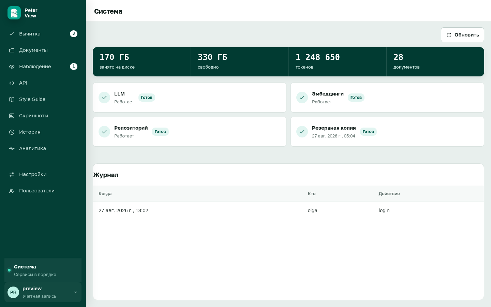

# Резервная копия данных

Результат: в каталоге `./backups` на хосте появляется tar с пользователями, гайдами и отчётами.

```bash
make backup
```

Команда выполняется внутри контейнера backend и записывает архив в `/app/backups`. На машине это каталог `./backups`.

Том `backend-data` не входит в образы. Обновление образа не удаляет пользователей.

Состояние последней копии видно администратору в разделе «Система».



Восстановление: `make down`, распакуйте tar в данные тома, запустите стек снова. Число хранимых снимков задаёт `BACKUP_KEEP` в `.env`, по умолчанию 7.
