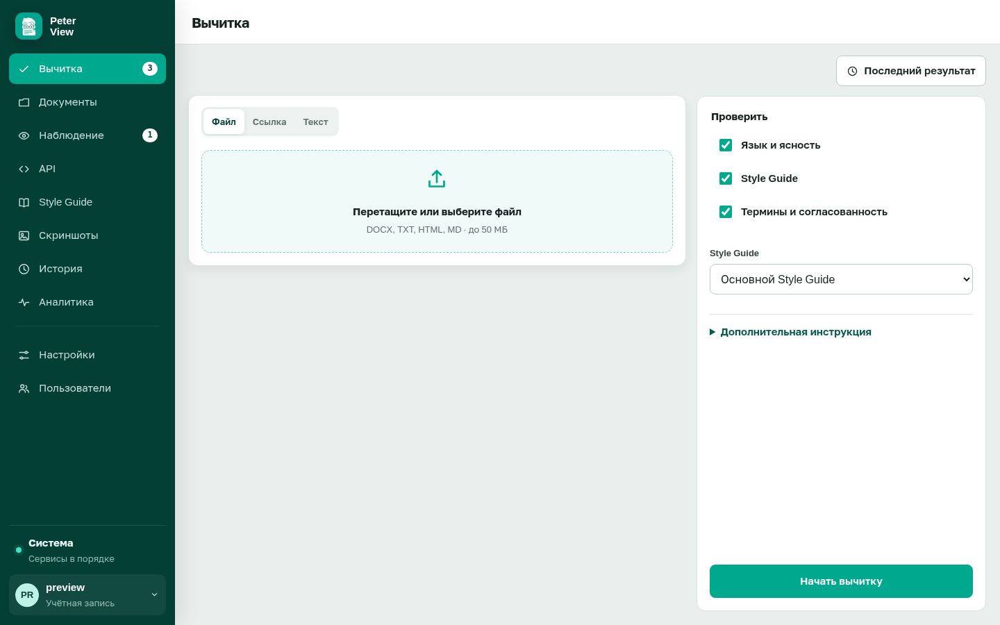

# Проверка текста, файла или страницы

Требуется вход в систему. Результат: экран «Очередь решений» с замечаниями по выбранному источнику.

Откройте раздел «Вычитка» в левом меню.

## Источник

Три вкладки над полем ввода. Заполните одну.

**Файл.** Форматы DOCX, TXT, HTML, MD. Максимальный размер 50 МБ. PDF не поддерживается. Файл можно перетащить в пунктирную область или выбрать с диска. Имя выбранного файла появляется над кнопкой запуска.

**Ссылка.** Адрес страницы со схемой `http://` или `https://`. Система загружает текст самостоятельно. Для страниц во внутренней сети в `.env` должно быть `PROOFREADER_SSRF_ALLOW_PRIVATE=true`. На узле, доступном из интернета, поставьте `false`.

**Текст.** Вставка в поле, не более 500 000 знаков.

Если все источники пустые, кнопка «Начать вычитку» показывает уведомление и запрос не отправляет.

Кнопка «Последний результат» в шапке раздела открывает отчёт текущей сессии, если проверка уже выполнялась.

## Состав проверки

Справа три независимых параметра. Включите хотя бы один.

**Язык и ясность.** Грамматика, пунктуация, неудачные формулировки.

**Style Guide.** Правила выбранного гайда. Список гайдов доступен только при включённом параметре. Активный гайд назначается в разделе «Style Guide» кнопкой «Использовать».

**Термины и согласованность.** Словарь гайда и единообразие наименований.

Блок «Дополнительная инструкция» раскрывается по щелчку. Текст из него передаётся в проверку языковой моделью. Если модель не настроена, поле можно оставить пустым.

## Запуск

Нажмите «Начать вычитку». Во время выполнения отображается индикатор. Готовый результат: «Очередь решений».

Далее: [работа со списком замечаний](review.md).
