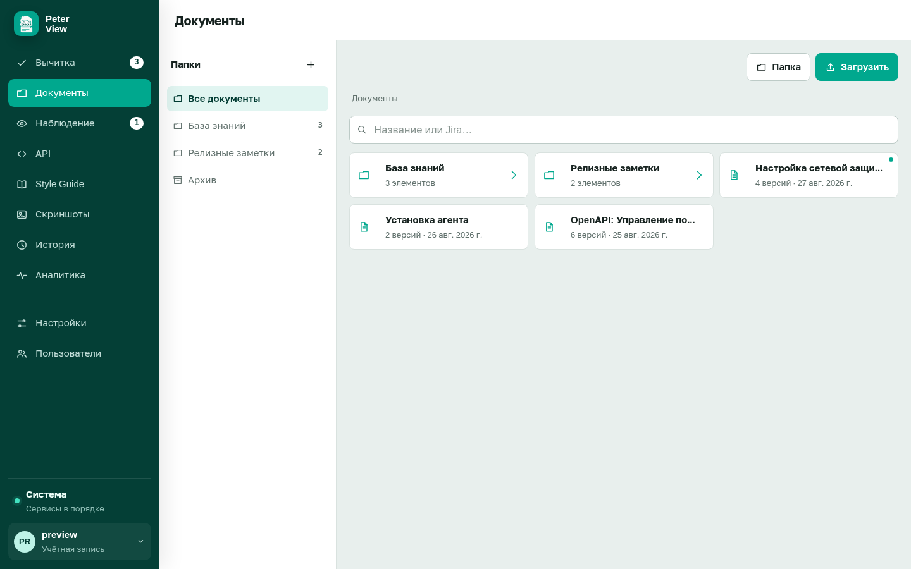

# Включение дополнительных разделов

После установки в меню нет пунктов «Документы», «API», «Наблюдение» и «Скриншоты». Вычитка, Style Guide, история и аналитика от флагов не зависят.

Флаги задаются в `.env` рядом с `docker-compose.yml`. Можно включить один флаг или несколько. Интерфейс пересобирать не требуется.

```env
FEATURE_DOCUMENTS=true
FEATURE_API=true
FEATURE_WATCH=true
FEATURE_SCREENSHOTS=true
```

Затем `./deploy.sh`.

Выключенный раздел исчезает из меню. Запрос к его адресу `/api/...` возвращает 404. Прежний хеш `#/documents` перенаправляет в «Вычитку».

| Флаг | Раздел | Назначение | Инструкция |
|---|---|---|---|
| `FEATURE_DOCUMENTS` | Документы | Папки, версии файлов, архив, поиск по Jira | [Документы](documents.md) |
| `FEATURE_API` | API | Связка OpenAPI RU/EN. Нужен также репозиторий документов | [OpenAPI](api.md) |
| `FEATURE_WATCH` | Наблюдение | Снимки страниц, отличие, суточный цикл | [Наблюдение](watch.md) |
| `FEATURE_SCREENSHOTS` | Скриншоты | Кадрирование и скрытие областей для иллюстраций | [Скриншоты](screenshots.md) |

Для связки OpenAPI включите оба: `FEATURE_DOCUMENTS` и `FEATURE_API`. Учебные YAML: `examples/openapi/library-ru.yaml` и `library-en.yaml`.




