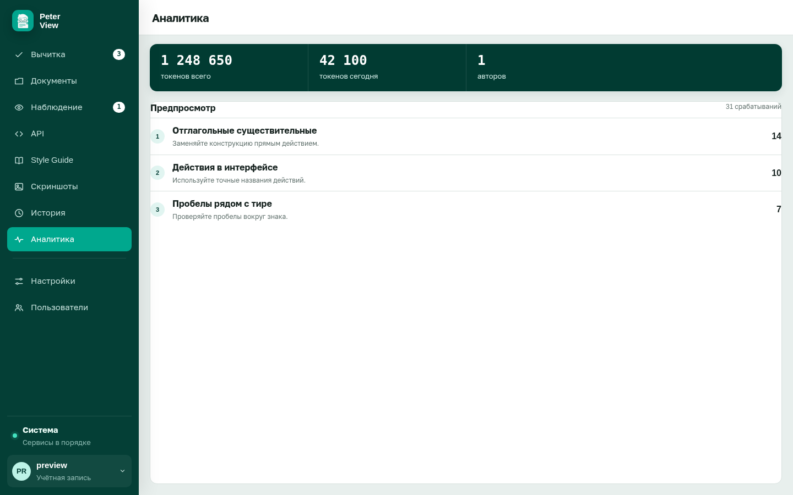

# История и аналитика

Оба раздела доступны сразу после установки, без флагов. Они отвечают на вопросы «что уже проверяли» и «какие правила срабатывают чаще».

## История

Таблица последних 50 завершённых проверок.

| Колонка | Содержание |
|---|---|
| Источник | имя файла, адрес или «Текст»; ниже разбивка ошибок, замечаний и советов |
| Дата | время завершения |
| Находки | общее число карточек |
| Style Guide | имя гайда, если он участвовал |

Стрелка в строке открывает тот же отчёт на экране «Очередь решений».

Пустая история: «История пуста» и кнопка «Начать вычитку».

История не заменяет исходный файл. Скрытые в очереди карточки в сохранённом отчёте остаются.

## Аналитика

В шапке три числа: токены всего, токены за сегодня, число авторов с находками. Счётчики токенов заполняются, если использовалась языковая модель. Без модели они остаются нулями, а список правил всё равно строится по отчётам.

Ниже блоки по авторам. В блоке: логин, сумма срабатываний, правила по убыванию частоты. У правила название, краткое описание и число попаданий.

Пока проверок нет, страница показывает пустое состояние с предложением запустить вычитку.

Далее: [список замечаний](review.md).
