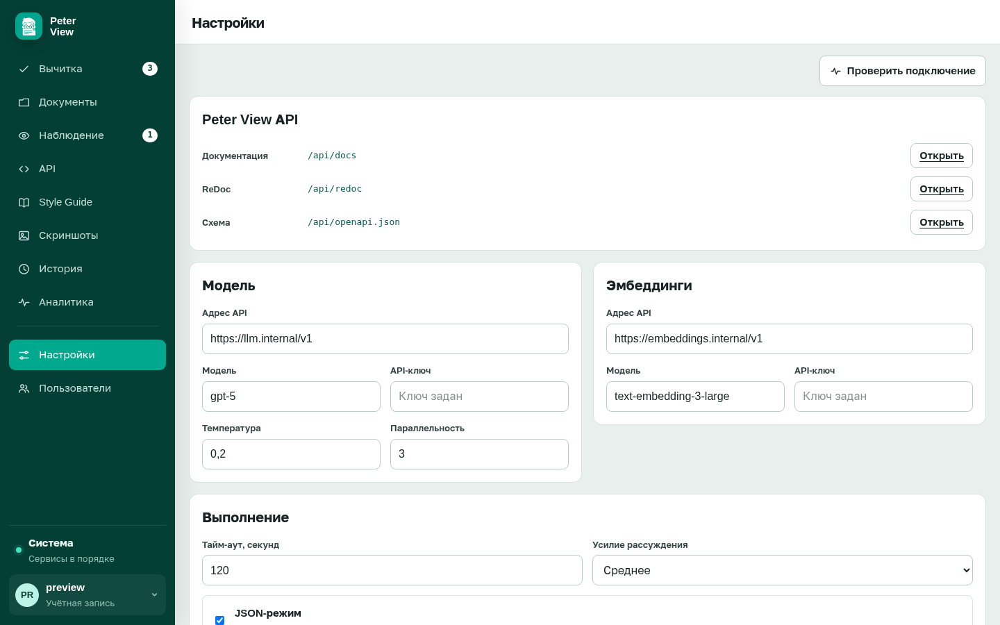

# Подключение языковой модели

Требуется роль администратора и сервер с протоколом OpenAI, метод `chat/completions`. После настройки в списке замечаний появляются находки, которые нельзя выразить правилом: сбивчивый абзац, неверный термин в контексте.

Без этой настройки грамматика и Style Guide уже работают. Языковая модель не обязательна.

Откройте «Настройки» в левом меню. Пункт виден только администратору.

## Модель

Блок «Модель»:

1. Адрес API. Обычно корень с `/v1` на конце
2. Имя модели
3. Ключ. Если ключ уже сохранён, поле показывает «Ключ задан»
4. Температура (0–2) и параллельность запросов (1–20)
5. «Сохранить настройки»

«Проверить подключение» в шапке страницы обращается к сохранённым адресам модели и эмбеддингов. Если какой-либо адрес не отвечает, уведомление перечисляет имена проблемных подключений. Если оба отвечают: «Подключения работают».

Блок «Выполнение»:

- тайм-аут в секундах, от 5 до 600
- усилие рассуждения: низкое, среднее, высокое
- JSON-режим: структурированный ответ модели

## Эмбеддинги

Задаются в соседнем блоке теми же полями: адрес, имя, ключ. Они нужны для смыслового поиска по гайду. При пустых полях поиск идёт по словам; в списке гайдов это отображается бейджем.

## Документация HTTP API

На этой же странице ссылки `/api/docs`, `/api/redoc`, `/api/openapi.json`. Они открываются, только если `PROOFREADER_DOCS=true`. В производственной среде оставьте `false`.

## Через .env

Заполните `LLM_BASE_URL`, `LLM_API_KEY`, `LLM_MODEL` и пересоздайте контейнер: `./deploy.sh`. Значения, сохранённые администратором в «Настройках», хранятся в томе и имеют приоритет над файлом.

Пустой адрес в обоих местах означает: слой модели не вызывается. Это не ошибка установки.

Имена переменных: [справка](../reference/config.md). Состояние подключений также видно в [системе](health.md).
