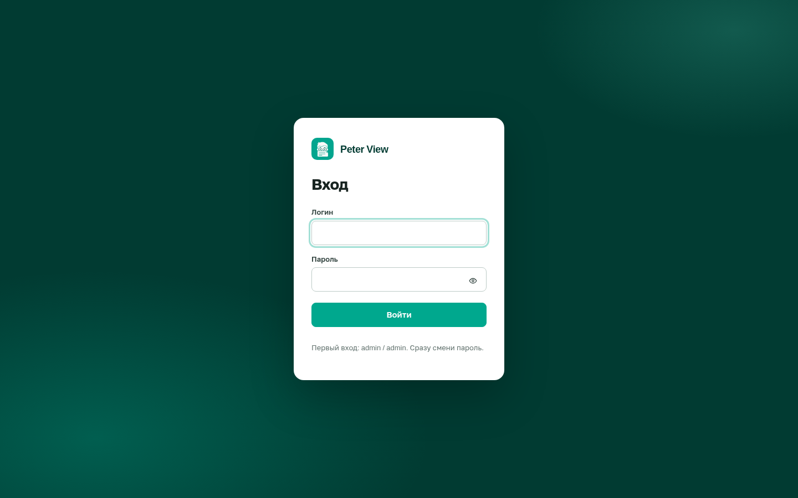

# Вход через организацию

Нужен IdP с authorization code: Keycloak, Azure AD, Okta. Задача: на экране входа кнопка «Войти через организацию», люди без пароля в Peter View.

## Что прописать

В `.env`:

```env
OIDC_ISSUER=https://idp.example.ru/realms/docs
OIDC_CLIENT_ID=
OIDC_CLIENT_SECRET=
OIDC_REDIRECT_URI=https://<хост>/api/auth/oidc/callback
OIDC_ADMIN_GROUPS=docs-admins
```

`OIDC_ISSUER` без слэша на конце. Redirect в клиенте IdP должен совпасть с `OIDC_REDIRECT_URI` символ в символ.

Пересоздайте стек. На экране входа появится вторая кнопка «Войти через организацию». Пока `OIDC_ISSUER` пуст, кнопки нет: вход только логином и паролем.



Пользователь из IdP получает роль редактора, пока одна из групп в токене не совпадёт с `OIDC_ADMIN_GROUPS` (список через запятую). Локального пароля у такой учётной записи нет.

Сессия та же, что после пароля: 12 часов, cookie `proofreader_session`.

## Keycloak

Клиент confidential, standard flow. Valid redirect URIs как `OIDC_REDIRECT_URI`. Группы должны попасть в токен.

## Azure AD

App registration, платформа Web, тот же redirect. Issuer:

```
https://login.microsoftonline.com/<tenant>/v2.0
```

Группы в ID token или userinfo.

SAML и LDAP этим выпуском не включаются.
