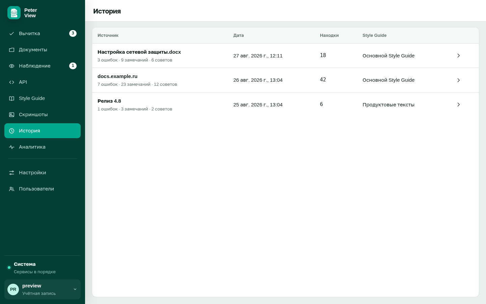

# Работа со списком замечаний

Требуется готовый отчёт. Цель: просмотреть замечания и оставить на экране те, которые будут учтены в исходном документе.

## Экран

Слева документ. Фрагменты с замечаниями выделены рамкой. Вертикальная полоса рядом с текстом показывает расположение находок по высоте.

Справа карточки. На карточке: важность (Ошибка, Замечание, Совет), номер строки, источник (Vale, LanguageTool, морфология), формулировка, цитата. Если предложена замена, исходный фрагмент зачёркнут, новый указан рядом.

Подпись источника нужна при разборе ложных срабатываний. При обычном просмотре её можно не учитывать.

В шапке: «Новая проверка» возвращает к форме. «Экспорт» сохраняет xlsx.

## Фильтры

Над списком: «Все», «Ошибки», «Замечания», «Советы». Цифра на кнопке: число находок этого типа в отчёте.

## Клавиши

Пока фокус не находится в поле ввода:

- `J` следующая карточка
- `K` предыдущая
- `H` скрыть текущую

Скрытые замечания из отчёта не удаляются. Кнопка «Скрытые: N» внизу списка восстанавливает все скрытые карточки.

Щелчок по рамке в тексте открывает соответствующую карточку.

## Экспорт и повторный просмотр

«Экспорт» сохраняет файл xlsx. В файл попадают карточки, которые в этот момент не скрыты.

«Новая проверка» возвращает к форме. Загруженный файл сбрасывается. Текст, введённый вручную, в поле сохраняется.

Пока сессия не закрыта, на форме вычитки доступна кнопка «Последний результат». Предыдущие проверки: раздел «История».

В таблице: источник, дата, число находок, имя гайда. Стрелка в строке снова открывает «Очередь решений».
