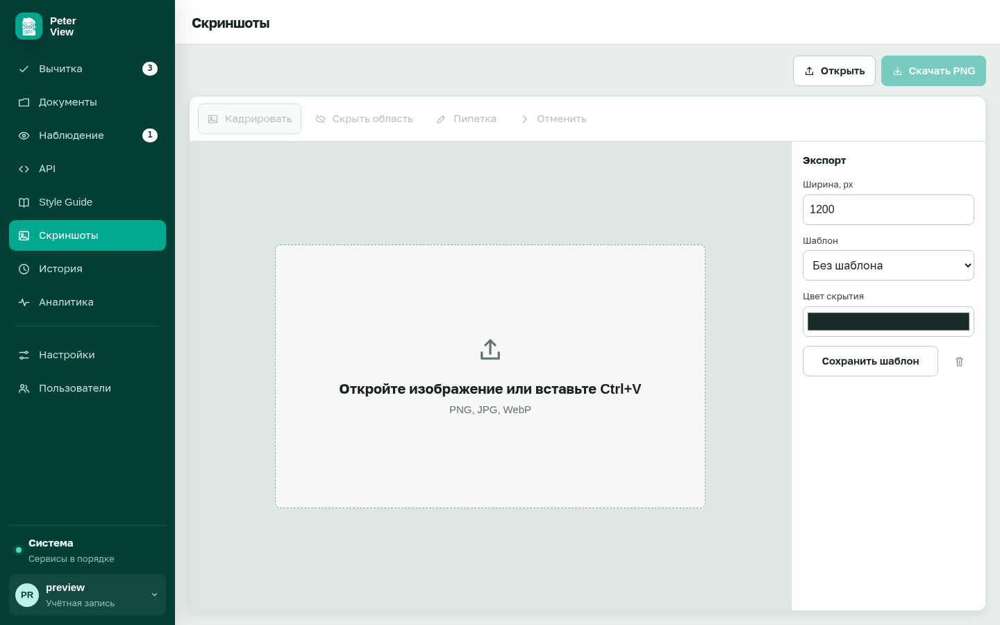

# Редактор скриншотов

Требуется `FEATURE_SCREENSHOTS=true`. Раздел готовит иллюстрации для документации: кадрирование, скрытие областей, шаблон ширины.

Это не хранилище снимков продукта. Файл открывается, обрабатывается, скачивается. Шаблоны ширины сохраняются на сервере.

## Загрузка

«Открыть» принимает PNG, JPG, WebP. Изображение можно вставить из буфера: Ctrl+V. Пока файла нет, на холсте подсказка «Откройте изображение или вставьте Ctrl+V».

## Инструменты

Слева. Пока изображение не открыто, кнопки неактивны.

| Инструмент | Действие |
|---|---|
| Кадрировать | выделить прямоугольник, остальное отрежется |
| Скрыть область | залить прямоугольник цветом скрытия |
| Пипетка | взять цвет с изображения в поле «Цвет скрытия» |
| Отменить | предыдущий шаг |

Проведите мышью по изображению, чтобы применить выбранный инструмент.

## Экспорт

Справа:

- ширина в пикселях, от 100 до 4000, по умолчанию 1200
- шаблон: подставляет сохранённую ширину
- цвет скрытия, по умолчанию `#172b28`

«Сохранить шаблон» запоминает текущую ширину под названием. Удаление: значок корзины у выбранного шаблона.

«Скачать PNG» сохраняет результат. Пока изображения нет, кнопка неактивна.

Включение флага: [дополнительные разделы](features.md).
