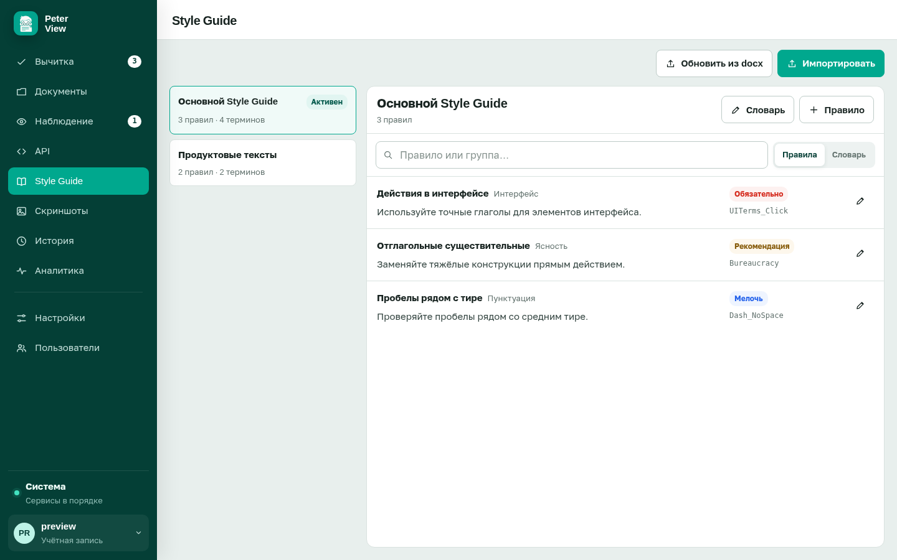

# Назначение и импорт Style Guide

Требуется вход в систему. Изменять правила может только администратор. Редактор назначает гайд для проверки и читает формулировки.

Слева список гайдов. Справа правила открытого гайда: название, группа, формулировка. Поиск над списком ищет по названию, группе и тексту. Вкладки «Правила» и «Словарь».

Гайд участвует в проверке, только если на форме вычитки включён параметр «Style Guide».

## Назначение гайда

Откройте нужный гайд. Если бейдж «Активен» отсутствует, нажмите «Использовать». Выбранный гайд появится в списке на форме вычитки.

Встроенный набор удалить нельзя. Собственный гайд удаляется значком корзины после подтверждения.

## Импорт документа

Администратор: кнопка «Импортировать». Форматы DOCX, TXT или MD. Пока документ разбирается, на странице отображается стадия обработки. Когда правила появятся справа, проверьте названия.

Диалог после разбора показывает извлечённые правила и словарь. Сохраните, если формулировки верны.

Обновление того же файла: «Обновить из docx» у открытого гайда. Система показывает добавленные, изменённые и удалённые правила. Отметьте, что следует принять.

## Правило вручную

У открытого гайда кнопка «Правило» (новое) или правка существующего. Укажите название и формулировку, сохраните.

## Словарь

Вкладка «Словарь» и диалог «Словарь Style Guide». Два списка: запрещённые и разрешённые выражения, по одному на строку. Словарь участвует в параметре «Термины и согласованность».

Как гайд участвует в проверке: [откуда берутся замечания](../explanation/engines.md).
