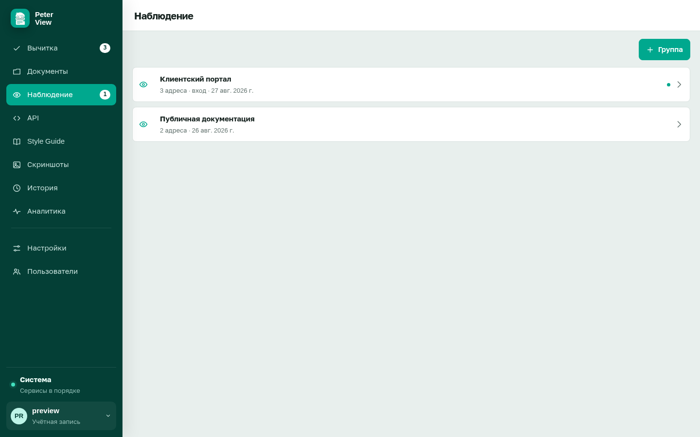

# Наблюдение за страницами

Требуется `FEATURE_WATCH=true`. Раздел снимает страницы и показывает, изменился ли текст. Без флага пункта в меню нет, фоновый цикл не запускается.

Имеет смысл для регламентов и порталов, которые нельзя забыть перевычитать после правки на сайте.

## Группа

«Группа» создаёт набор страниц с общей схемой входа.

- название
- вход: «Без входа», «Форма на сайте», «HTTP Basic»
- для формы: страница входа, логин, пароль, при необходимости имена полей формы
- для Basic: логин и пароль

Если пароль уже сохранён, поле можно оставить пустым.

Список групп: число адресов, признак входа, дата последнего прогона. Счётчик на пункте меню показывает, сколько страниц изменилось.

Удаление группы удаляет страницы и снимки.

## Страницы группы

Откройте группу. Поля URL и название, кнопка «Добавить».

«Проверить» в шапке запускает съём всех страниц группы. Пока прогон идёт, кнопка показывает «Проверяем…».

Дополнительно раз в сутки сервер сам запускает съём, если флаг включён.

## Снимок страницы

Щелчок по адресу открывает отличие от предыдущего снимка. Статусы:

| Статус | Значение |
|---|---|
| не проверялась | съёма ещё не было |
| без изменений | текст совпал с прошлым снимком |
| изменилась | есть отличие |
| ошибка | страница не загрузилась |

«Проверить» на карточке страницы снимает только её. Удаление адреса удаляет снимки этой страницы.

Включение флага: [дополнительные разделы](features.md).
