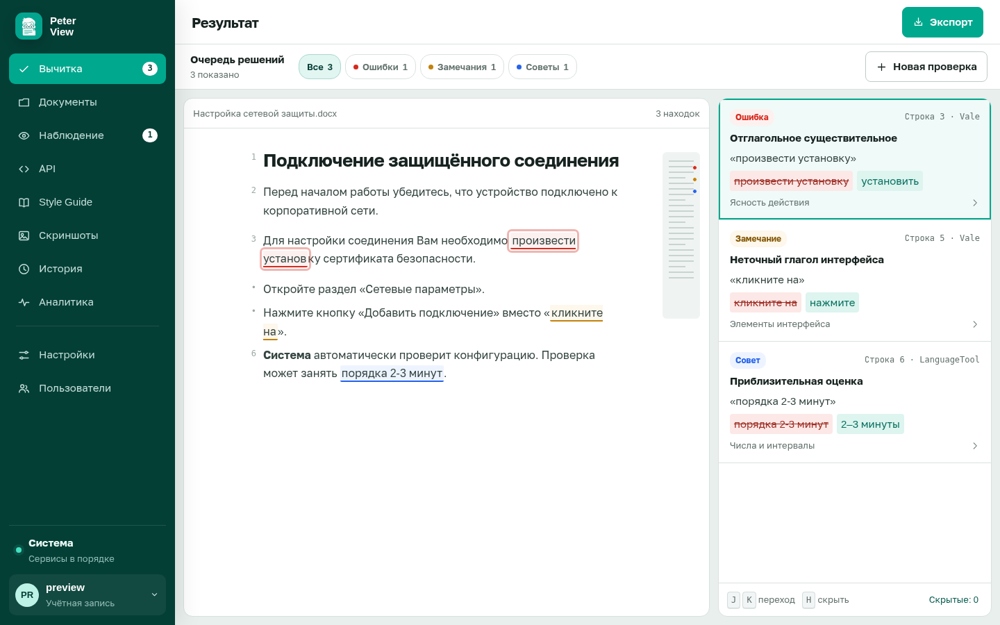

# Документация

Peter View - система автоматической вычитки русской документации. Она проверяет грамматику, корпоративный стиль и термины и возвращает список замечаний, привязанных к фрагментам текста.

Документация читается по задаче: сначала установка, затем отдельная инструкция на действие, затем справка и устройство.

## Начало работы

Установка Docker Compose и одна контрольная проверка на фиксированном фрагменте.

- [Установка и первый запуск](tutorial.md)

## Проверка документов

- [Проверка текста, файла или страницы](how-to/check.md)
- [Работа со списком замечаний](how-to/review.md)
- [Назначение и импорт Style Guide](how-to/styleguide.md)
- [История и аналитика](how-to/history.md)

## Администрирование

- [Пользователи](how-to/users.md)
- [Подключение языковой модели](how-to/llm.md)
- [Состояние сервисов](how-to/health.md)
- [Включение дополнительных разделов](how-to/features.md)
- [Документы](how-to/documents.md)
- [Связка OpenAPI](how-to/api.md)
- [Наблюдение за страницами](how-to/watch.md)
- [Редактор скриншотов](how-to/screenshots.md)
- [Вход через организацию](how-to/oidc.md)
- [Резервная копия данных](how-to/backup.md)
- [Не запускается](how-to/troubleshoot.md)

## Справка

- [Переменные .env](reference/config.md)
- [Роли](reference/roles.md)
- [Разделы интерфейса](reference/sections.md)
- [Команды Compose](reference/compose.md)
- [Хранилище](reference/data.md)
- [HTTP API](reference/http.md)

## Устройство

- [Назначение системы](explanation/what.md)
- [Откуда берутся замечания](explanation/engines.md)
- [Как проходит проверка](explanation/pipeline.md)
- [Архитектура](explanation/architecture.md)
