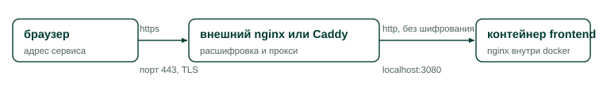

# TLS и обратный прокси

Эта страница описывает, как поставить перед сервисом внешний прокси с HTTPS. Она
нужна администратору, который выводит Peter View на доменное имя площадки.

Сам стек TLS не терминирует. Nginx внутри контейнера frontend слушает восьмой
порт и отдает голый HTTP. Задачей внешнего прокси на хосте является терминация
TLS. Разделение сознательное: сертификат, получение сертификата по ACME и
заголовок HSTS живут у администратора площадки, а не у приложения.

## Эталонная схема

На схеме показан путь запроса от браузера до контейнера.

<figure>
  
  <figcaption>Единственная точка, доступная снаружи это порт 443 внешнего прокси. Порт 3080 контейнера frontend опубликован только на localhost и наружу не смотрит.</figcaption>
</figure>

Внешний прокси принимает соединение по HTTPS на порту 443, расшифровывает его и
передает запрос на порт 3080 localhost, где опубликован nginx контейнера
frontend. Порт 3080 берут из переменной `PROOFREADER_PORT`, описанной на
странице [**Переменные окружения**](config-env.md).

## Пример конфигурации для внешнего nginx

Ниже приведен рабочий файл для внешнего nginx. Разбор обязательных строк следует
за листингом.

```nginx
server {
    listen 443 ssl;
    http2 on;
    server_name peterview.example.ru;

    ssl_certificate     /etc/letsencrypt/live/peterview.example.ru/fullchain.pem;
    ssl_certificate_key /etc/letsencrypt/live/peterview.example.ru/privkey.pem;

    client_max_body_size 60m;   # запас над 50m у внутреннего nginx

    location / {
        proxy_pass http://127.0.0.1:3080;
        proxy_http_version 1.1;
        proxy_set_header Host              $host;
        proxy_set_header X-Real-IP         $remote_addr;
        proxy_set_header X-Forwarded-For   $proxy_add_x_forwarded_for;
        proxy_set_header X-Forwarded-Proto $scheme;

        # SSE: стрим прогресса проверки не должен буферизоваться
        proxy_buffering    off;
        proxy_read_timeout 900s;
    }
}

server {
    listen 80;
    server_name peterview.example.ru;
    return 301 https://$host$request_uri;
}
```

Четыре настройки в этом файле нельзя пропустить.

1. Отключение буферизации ответа (`proxy_buffering off`) обязательно. Иначе
   стрим прогресса проверки на пути `/api/jobs/*/stream` перестает быть
   потоковым: браузер висит без новостей, а потом получает все сразу. Внутренний
   nginx буферизацию для этого пути выключает сам, но внешний обязан сделать то
   же, иначе настройка внутреннего бессмысленна.
2. Тайм-аут чтения ставят не короче 600 секунд, поскольку длинная проверка
   моделью живет до 900 секунд (переменная `LLM_JOB_TIMEOUT`). Внутренний nginx
   уже ждет 600 секунд на чтение и отправку, листинг выше поднимает внешнюю
   планку до 900.
3. Ограничение размера тела запроса (`client_max_body_size`) берут выше 50 МиБ,
   которые разрешает внутренний nginx. Иначе DOCX предельного размера отсекается
   внешним прокси с кодом 413 раньше, чем его увидит приложение.
4. Заголовок `Host` обязателен к корректному пробросу (строка
   `proxy_set_header Host $host`). Приложение сверяет происхождение запроса с
   заголовком `Host`, как описано на странице [**Механизмы защиты**](../arch/security.md). Искаженный
   `Host` приводит к ложным отказам с кодом 403 и сообщением «Перекрёстный
   запрос отклонён». Заголовки `X-Real-IP`, `X-Forwarded-For` и
   `X-Forwarded-Proto` приложение не читает, но они нужны для корректных логов
   и для будущих доработок.

Второй блок `server` нужен для редиректа с HTTP на HTTPS. Заголовок HSTS сюда не
включен: его добавляют на странице [**Жесткая настройка для публичного хоста**](hardening.md).

## Что изменить в конфигурации приложения после включения TLS

После появления HTTPS на внешнем прокси обязательны два действия.

1. Установите `PROOFREADER_COOKIE_SECURE=true` в `.env` и перезапустите стек.
   Сессионная cookie получит флаг `Secure` и перестанет уходить по HTTP.
2. Если часть пользователей заходит с другого origin, например с домена-алиаса,
   добавьте этот origin в `PROOFREADER_CORS_ORIGINS` через запятую. Развертывание
   в пределах одного origin ничего добавлять не требует.

## Пример для Caddy

Конфигурация Caddy короче, потому что часть настроек там включена по умолчанию.

```text
peterview.example.ru {
    reverse_proxy 127.0.0.1:3080
    flush_interval -1
}
```

Caddy самостоятельно получает сертификат Let's Encrypt, редиректит HTTP на HTTPS
и пробрасывает `Host`. Значение `flush_interval -1` отключает буферизацию
ответа и нужно для того же стрима прогресса.

## Ошибки, которые ломают защиту

Три варианта настройки вредны и встречаются в практике.

- Не публикуйте наружу порты backend (8000) и languagetool (8010). Стек
  спроектирован так, что единственным входом является порт nginx контейнера
  frontend. Публикация backend ломает предпосылку проверки происхождения
  запроса, поскольку приложение сравнивает `Host` и ничего не знает о вашем
  прокси, а публикация languagetool выводит проверяющий сервис в интернет.
- Не включайте мост корпоративного прокси (`172.17.0.1:3128`) на хосте с белым
  адресом. Так вы получите открытый прокси в интернете.
- Не запускайте приложение на базовом порту с публикацией `80:80` «временно»,
  без прокси. Тогда у запросов нет заголовка `X-Real-IP`, проверка происхождения
  сверяет origin с голым хостом, а cookie уходит по HTTP.

## Проверка результата

После настройки прокси убедитесь в четырех вещах.

1. Запрос к `http://домен/` отвечает редиректом 301 на `https://`.
2. Страница входа открывается по HTTPS, а в DevTools у cookie PVSESSION стоит
   флаг Secure.
3. Отправьте длинный текст на проверку моделью и убедитесь, что карточки воркеров
   появляются постепенно, а не пачкой в конце (признак работы SSE без
   буферизации).
4. Выполните вход и сохранение настроек (не-GET запрос) и убедитесь, что ответа
   403 с сообщением «Перекрёстный запрос отклонён» нет.

## Связанные разделы

Страницы, продолжающие тему сетевой настройки.

- [Стек контейнеров](stack.md) описывает конфигурацию внутреннего nginx и карту
  его location.
- [Переменные окружения](config-env.md) содержит `PROOFREADER_COOKIE_SECURE` и
  `PROOFREADER_CORS_ORIGINS`.
- [Жесткая настройка для публичного хоста](hardening.md) добавляет к этой
  странице HSTS, брандмауэр и минимизацию поверхности атаки.
- [Механизмы защиты](../arch/security.md) объясняет, как устроена проверка
  происхождения запроса, о которой здесь идет речь.
