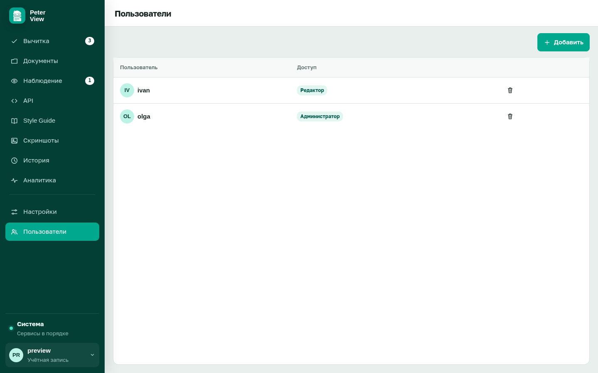

# Разделы интерфейса

Маршруты задаются hash. Адрес вида `http://localhost:3080/#/check`.

## Всегда на месте

| Раздел | Hash | Кто видит | Что там |
|---|---|---|---|
| Вычитка | `#/check` | все | Источник, параметры проверки, запуск |
| Очередь решений | `#/review` | все, после отчёта | Карточки, фильтры, J/K/H, экспорт xlsx |
| Style Guide | `#/guides` | все | Список гайдов, правила, словарь. Правки: admin |
| История | `#/history` | все | Последние 50 проверок |
| Аналитика | `#/insights` | все | Частые правила по авторам, токены |

## Только администратор

| Раздел | Hash | Что там |
|---|---|---|
| Пользователи | `#/users` | Создание, роли, удаление |
| Настройки | `#/settings` | URL модели и эмбеддингов, проверка связи |
| Система | `#/health` | Диск, LLM, эмбеддинги, репозиторий, резервная копия, журнал |

## По флагу

| Раздел | Hash | Флаг | Что там |
|---|---|---|---|
| Документы | `#/documents` | `FEATURE_DOCUMENTS` | Папки, версии, архив, поиск по Jira |
| API | `#/api` | `FEATURE_API` | Связка OpenAPI RU/EN. Учебные файлы: `examples/openapi/library-ru.yaml`, `library-en.yaml` |
| Наблюдение | `#/watch` | `FEATURE_WATCH` | Группы страниц, снимки, отличие. Без флага цикл не стартует |
| Скриншоты | `#/screenshots` | `FEATURE_SCREENSHOTS` | Кадрирование, скрытие областей, шаблоны ширины |

Выключенный раздел пропадает из меню. Запрос к его `/api/...` отвечает 404. Прежний hash перенаправляет в «Вычитку».

На узком экране те же разделы, меню сворачивается.

