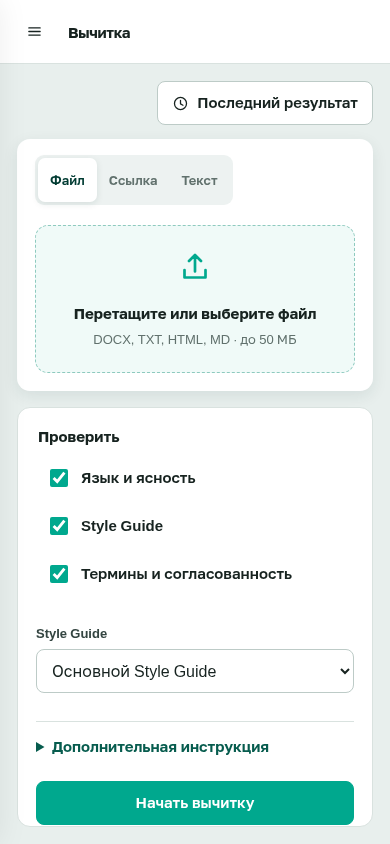

# Установка и первый запуск

В этом разделе вы установите Peter View и выполните одну проверку на контрольном фрагменте. Другие источники и настройки здесь не рассматриваются.

Требуются Docker Engine и плагин Compose.

## 1. Установка

В терминале:

```bash
git clone https://github.com/BadWisher/Peter-View.git
cd Peter-View
./deploy.sh
```

Если файла `.env` ещё нет, скрипт копирует пример. Запускаются три контейнера: интерфейс, сервер приложений, проверка языка. Проверка языка при первом запуске занимает около полутора минут: это отдельный Java-процесс.

Когда в терминале появится «Готово», откройте http://localhost:3080. Должен отображаться экран входа.


## 2. Вход и смена пароля

Логин `admin`, пароль `admin`, кнопка «Войти».

Откроется раздел «Вычитка».


Слева вкладки источника, справа параметры «Язык и ясность», «Style Guide», «Термины и согласованность».

Смените пароль сразу. Инициалы слева внизу → «Сменить пароль». Текущий пароль: `admin`. Новый: не короче 8 символов. Пока действует заводской пароль, любой доступ к порту даёт права администратора.

## 3. Контрольная проверка

Откройте вкладку «Текст». Вставьте этот фрагмент:

```
Для того чтобы произвести установку, кликните на кнопку Далее.
```

Оставьте включёнными все три параметра справа. Список гайдов не меняйте.

Нажмите «Начать вычитку». Появится индикатор выполнения. По завершении откроется экран «Очередь решений».


Слева фрагмент с рамками на найденных местах, справа карточки «Ошибка», «Замечание», «Совет».

На этом фрагменте обычно находятся канцелярит («произвести установку») и глагол интерфейса («кликните»). Если карточек нет, подождите ещё около минуты: проверка языка могла не завершить запуск.

## 4. Просмотр замечаний

`J` - следующая карточка, `K` - предыдущая, `H` - скрыть текущую, если замечание не будет учитываться.

Над списком фильтры «Ошибки», «Замечания», «Советы». «Экспорт» сохраняет видимые карточки в xlsx.

На узком экране тот же сценарий:



Дальше по задачам: [проверка файла или страницы](how-to/check.md), [работа со списком](how-to/review.md), [пользователи](how-to/users.md).
